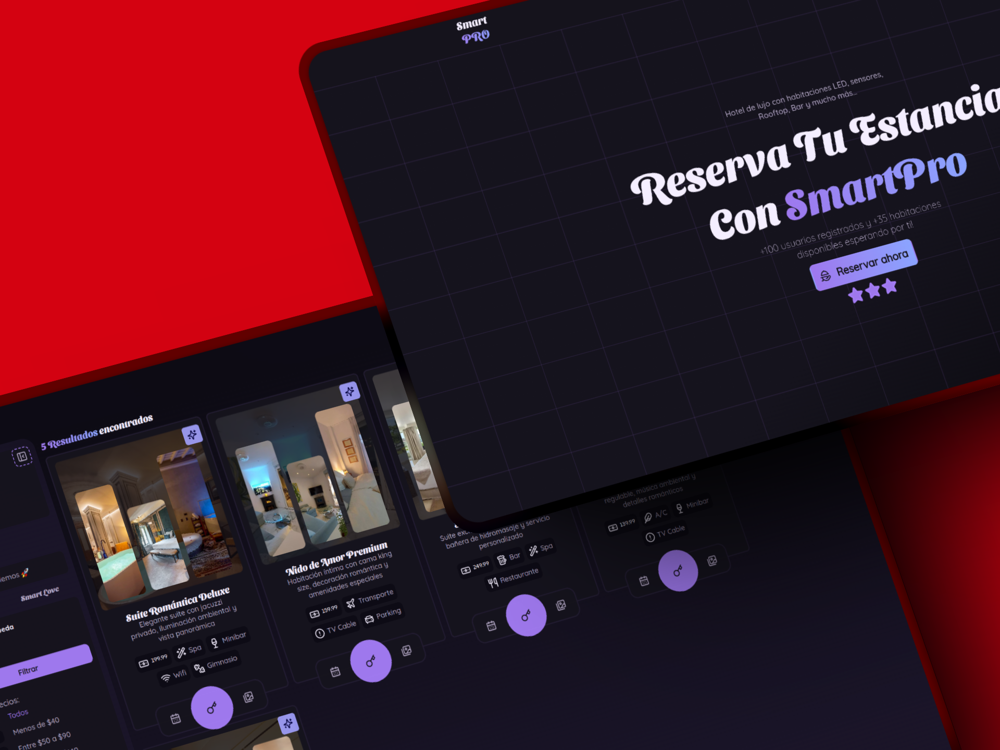
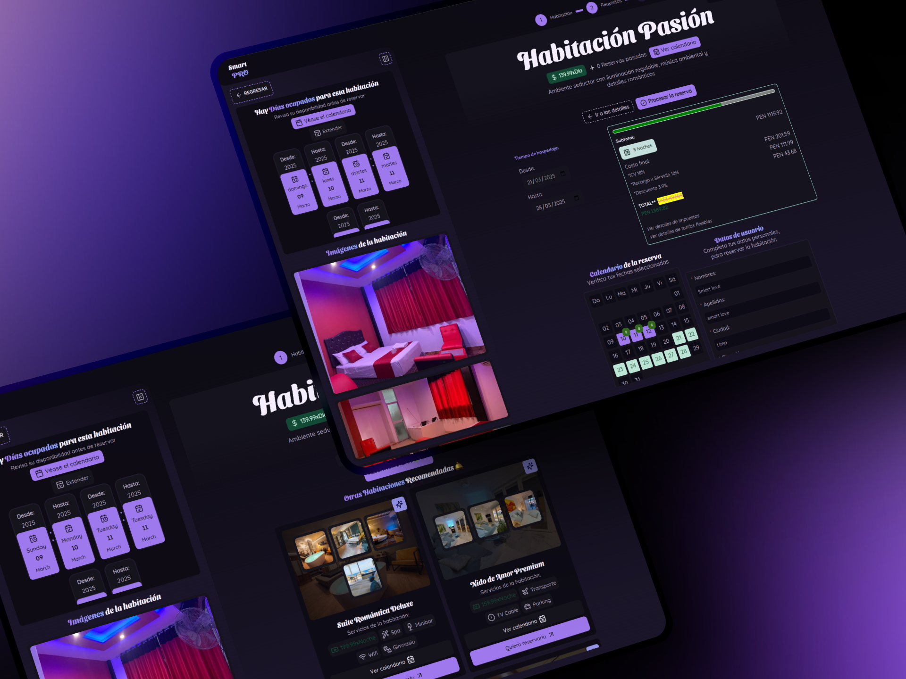
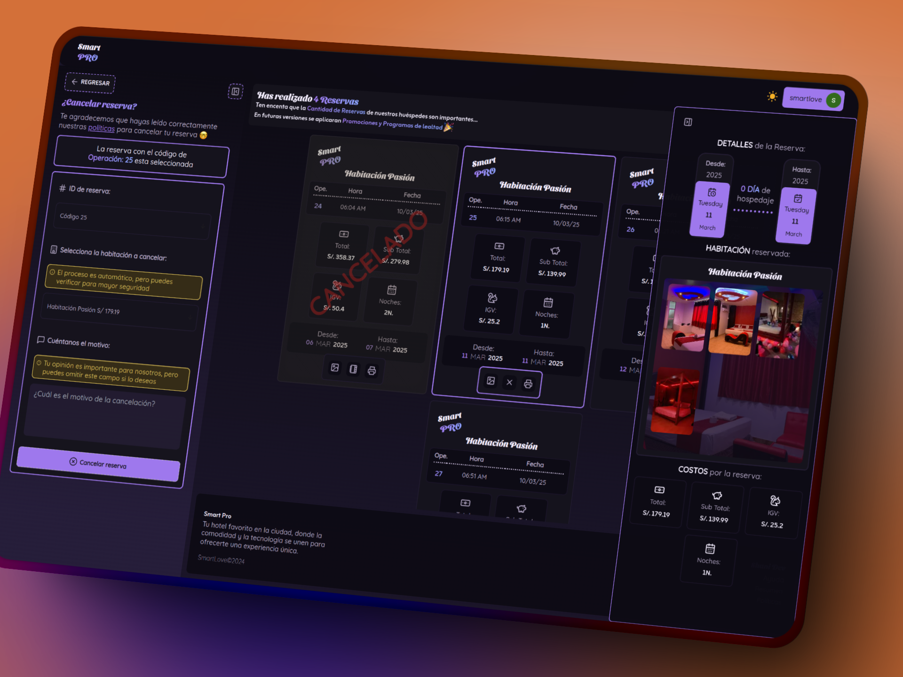

# Smart Love Hotel 🏨

<div style="padding: 20px; border: 2px solid #ddd; max-width: 900px; border-radius: 10px; margin: 20px 0;">
  
  
  
</div>

[](https://smart-pro.vercel.app)
[](https://www.figma.com/design/J7di2I31IH4OcXnNOmwgAe/Hotel---Smart-Love?node-id=218-1065&t=mRZzxxdUouw2DlMM-1)
[](https://opensource.org/licenses/MIT)

# 🌟 Smart Love Hotel

## 🎯 Sobre el Proyecto

Smart Love Hotel es una plataforma moderna de reservas hoteleras ubicada en Lima, Perú. Desarrollada con tecnologías morder, ofrece un sistema eficiente y seguro para la gestión de reservas y administración hotelera.
El proyecto se centra en proporcionar una experiencia de usuario óptima mediante una interfaz intuitiva y funcionalidades avanzadas.

## ✨ Características

- 🏷️ Reserva de habitaciones en tiempo real
- 📅 Calendario interactivo para selección de fechas
- 🔍 Filtros avanzados de búsqueda
- 📱 Diseño responsive y moderno
- 🌙 Modo oscuro/claro
- 🔒 Autenticación de usuarios
- 💳 Gestión de reservas
- 📊 Panel de administración intuitivo
- 🔄 Sincronización en tiempo real
- 📈 Análisis de disponibilidad

## 🛠️ Tecnologías

[](https://nextjs.org/)
[](https://www.typescriptlang.org/)
[](https://tailwindcss.com/)
[](https://sass-lang.com/)
[](https://day.js.org/)
[](https://www.mysql.com/)
[](https://www.prisma.io/)
[](https://react-hook-form.com/)
[](https://tanstack.com/query)

## 👨‍💻 Desarrolladores

[](https://github.com/Luis-Fernando-MP)
[](https://github.com/arianr2014)

## 🚀 Instalación

1. Instala [Node.js v20](https://nodejs.org/en/)

2. Instala PNPM globalmente:

   ```bash
   npm install -g pnpm
   ```

3. Clona el repositorio:

   ```bash
   git clone https://github.com/Luis-Fernando-MP/smartLove.git
   cd smart-love-hotel
   ```

4. Instala las dependencias:

   ```bash
   pnpm install
   ```

5. Configura las variables de entorno:

   - Crea un archivo `.env` en la raíz del proyecto
   - Copia las siguientes variables y configura sus valores:

   ```env
   # API URL
   NEXT_PUBLIC_API_URL=

   # Clerk Authentication
   NEXT_PUBLIC_CLERK_PUBLISHABLE_KEY=
   CLERK_SECRET_KEY=
   NEXT_PUBLIC_CLERK_SIGN_IN_URL=/sign-in
   NEXT_PUBLIC_CLERK_SIGN_UP_URL=/sign-up
   NEXT_PUBLIC_CLERK_AFTER_SIGN_IN_URL=/
   NEXT_PUBLIC_CLERK_AFTER_SIGN_UP_URL=/
   CLERK_WEBHOOK_USER_EVENTS=
   CLERK_WEBHOOK_USER_EVENTS_DEV=

   # Database
   DATABASE_URL=
   ```

6. Ejecuta el proyecto en modo desarrollo:

   ```bash
   pnpm dev
   ```

7. Para compilar el proyecto para producción:
   ```bash
   pnpm build
   pnpm start
   ```
