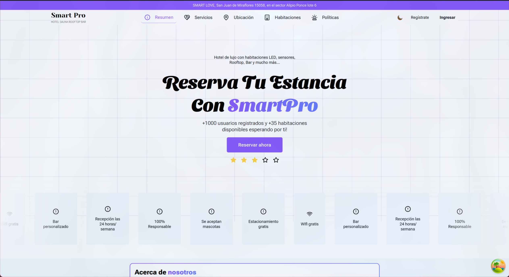
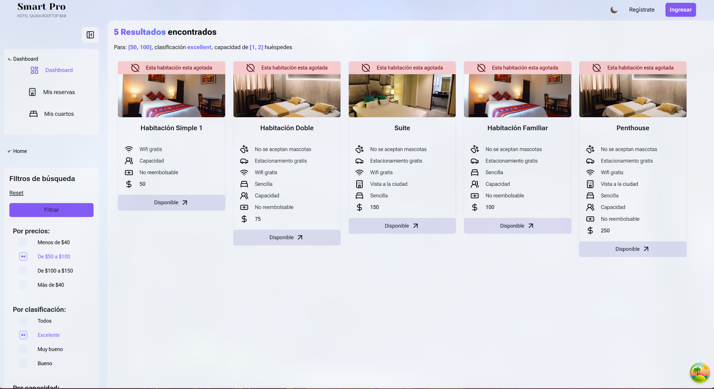
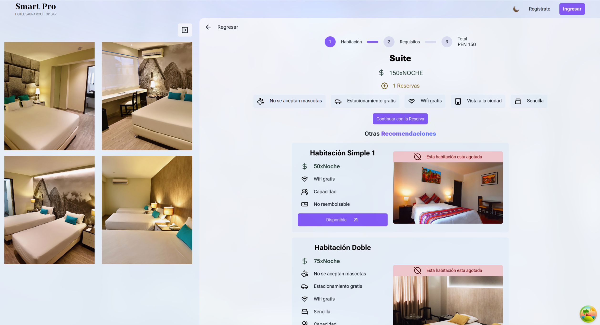
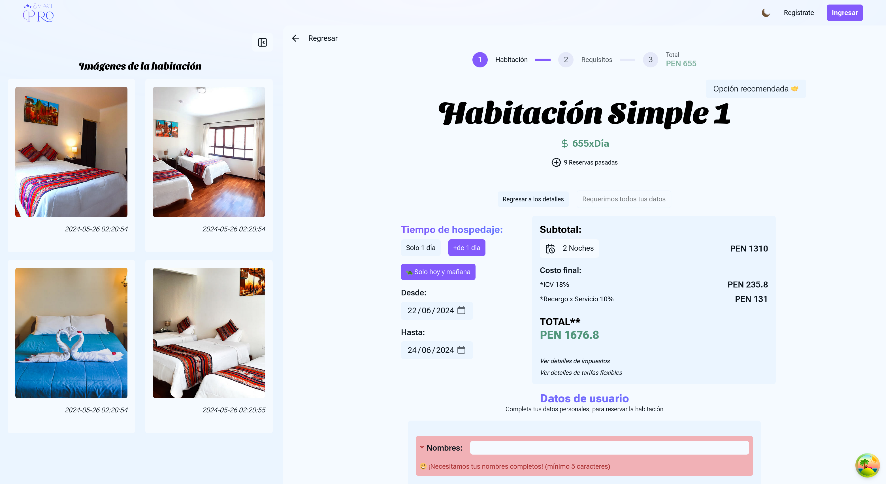
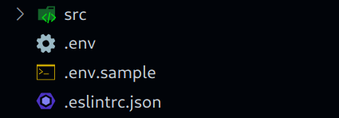
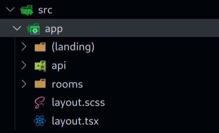
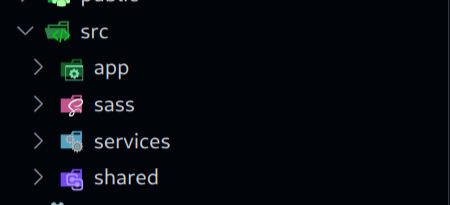

# TAREAS

## Largas

- [ ]: Culminar el flujo de cancelar una reserva
- [ ]: Realizar la pagina Home
- [ ]: Realizar la pagina Polices
- [ ]: Validar las fechas al momento de reservar una habitación
- [ ]: Manejar el tema de los filtros
- [ ]: Actualizar los filtros del componente SLUG
- [ ]: Acabar la pagina detalles de reservas /rooms/reservations

## Medianas

- [ ]: Agregar el footer en el flujo principal
- [ ]: Actualizar el Boton (Solo hoy y mañana) presenta un error
- [ ]: Desactivar el autocompleted en el formulario de creación de cliente
- [ ]: Transladar el Boton Regresar de la pagina /rooms/[room_id] a la izquierda

## Cortas

- [ ]: Cambiar los iconos de la presentación inicial
- [ ]: Actualizar la navegación (Home, Rooms, Polices)ç
- [ ]: Agregar la descripción de las reservas

# Extras

## Largas

- [ ]: Mejorar al presentación de las imágenes de Reservas
- [ ]: Actualizar los esqueletos de carga
- [ ]: Habilitar la ruta /rooms/[room_id]/images
- [ ]: Alzar el componente de visualización de images

## Cortas

- [ ]: Cambiar los colores de día:
  --bg-primary: #f4f2fff5;
  --bg-secondary: #ecebfff5;
  --fnt-primary: #000000;
  --fnt-secondary: #6f6f6f;
  --tn-primary: #8b61ff;
  --tn-primary-transparent: #b56aff1f;
  --tn-secondary: #3959ff;
  --disable-primary: #47455e;
  --disable-secondary: #5950c426;
  --skeleton-co: #E3F1FF;
  --skeleton: #CFDDEB;

# Proyecto Smart Pro





Para levantar la aplicación sigue los siguientes pasos.

1. Instala [nodeJS v20](https://nodejs.org/en/), ademas verifica tener al menos un sistema de gestor de paquetes:

- [npm v10.7.0](https://www.npmjs.com/)
- [pnpm v20.12.2](https://pnpm.io/installation)

2. clona el repositorio o realiza un fork
3. Crea un archivo .env en la raíz del proyecto y agrega la URL:



```env
  NEXT_PUBLIC_API_URL="http..."
```

4. dentro del proyecto instala las dependencias:

```bash
  npm i
  # or
  pnpm i
```

5. Ejecuta el proyecto en modo desarrollo

```bash
  npm run turbo
  # or
  pnpm turbo
```

# Paginas

- Todas las rutas se encuentran dentro de la carpeta /src/app



-La conexión a los servicios de la api se encuentran dentro de la carpeta /src/service y los estilos se crean por cada componente, se empleo el formato "style.scss"


