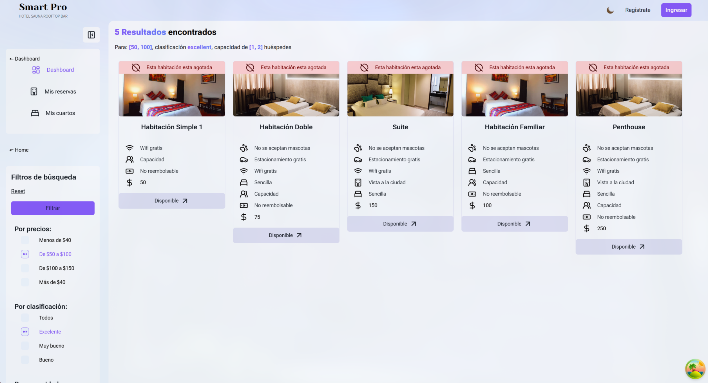

# Proyecto Smart Pro




Para levantar la aplicación sigue los siguientes pasos.

1. Instala [nodeJS v20](https://nodejs.org/en/), ademas verifica tener al menos un sistema de gestor de paquetes:

- [npm v10.7.0](https://www.npmjs.com/)
- [pnpm v20.12.2](https://pnpm.io/installation)

2. clona el repositorio o realiza un fork
3. Crea un archivo .env en la raíz del proyecto y agrega la URL:


```env
  NEXT_PUBLIC_API_URL="http..."
```

4. dentro del proyecto instala las dependencias:

```bash
  npm i
  # or
  pnpm i
```

5. Ejecuta el proyecto en modo desarrollo

```bash
  npm run turbo
  # or
  pnpm turbo
```

# Paginas

- Todas las rutas se encuentran dentro de la carpeta /src/app


-La conexión a los servicios de la api se encuentran dentro de la carpeta /src/service y los estilos se crean por cada componente, se empleo el formato "style.scss"


